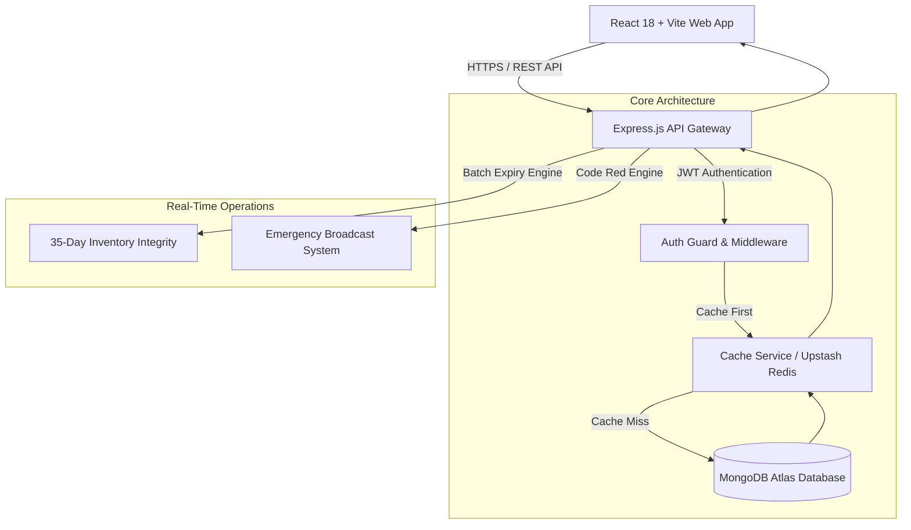
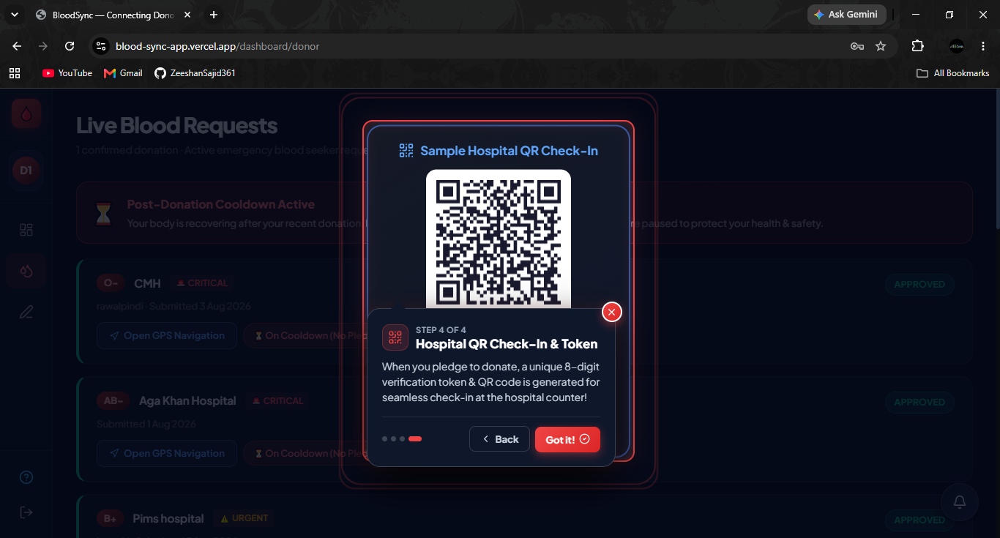
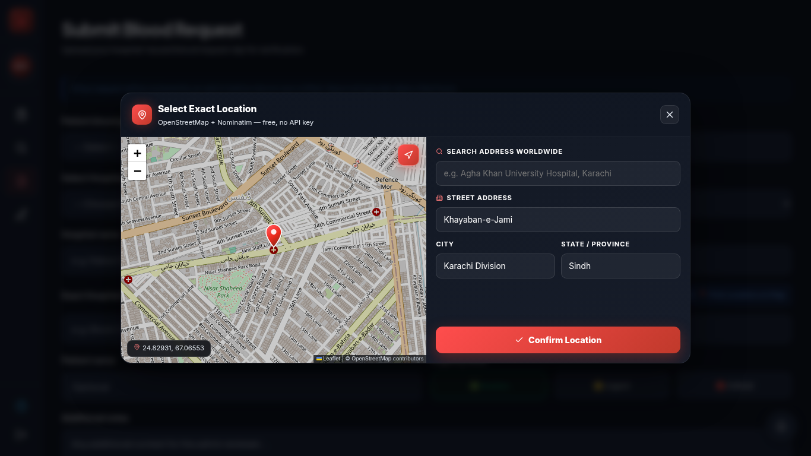

# 🩸 BloodGrid — Real-Time Community Blood Network & Inventory Management System

    

> **Save Lives, One Drop at a Time.**  
> BloodGrid is a production-grade, full-stack medical emergency platform designed to connect voluntary blood donors, patients in critical need, blood banks, and hospital emergency wards in real time across Pakistan.

---


---

## 📌 Executive Summary & Project Purpose

### ❓ The Problem
In critical emergency situations—such as traffic trauma, surgical complications, thalassemias, and sudden ICU shortages—the traditional blood donation pipeline suffers from severe bottlenecks:
1. **Critical Communication Delays**: Emergency blood requests take hours to reach eligible voluntary donors through manual phone calls and social media messages.
2. **Inventory Contamination & Expiry**: Hospitals frequently aggregate blood units into total figures without tracking batch-level expiration dates. Donated blood red cells expire after **35 days**, leading to expired units being mistakenly reported as available stock.
3. **Cross-Account & Performance Lag**: Web applications often suffer from blank screen delays on sign-in due to dynamic bundle downloads and unoptimized API fetching.
4. **Donor Health Risks**: Donors donating too frequently without enforced rest periods risk severe anemia, while hospitals lack reliable check-in verification tokens.

### 💡 Our Solution
**BloodGrid** re-engineers blood logistics into an intelligent, high-speed ecosystem:
* **Instant Emergency Matching (<15s)**: Automated Code Red broadcasting matches patients with compatible, eligible donors in their exact city.
* **Batch-Level Expiry Isolation (35-Day Rule)**: Enforces a strict 35-day shelf life on all blood bags. Expired or depleted stock is automatically moved to an isolated archive, preserving 100% stock metric accuracy.
* **0ms Stale-While-Revalidate (SWR) Caching**: Instant client-side hydration eliminates post-login loading delays while fetching background updates silently.
* **Multi-Role Security & PII Protection**: Donor contact information and exact locations are protected until verified medical requests require contact.

---

## 🏗 System Architecture & Flow



---

## 👥 Deep Dive: Profiles, Workflows & Screenshots

BloodGrid provides 5 dedicated user profiles, each built with tailored user interfaces and strict access control rules.

---

### 🏥 1. Hospital Management & Ready Stock Sync

**Purpose**: Empowers hospital staff and blood bank technicians to maintain accurate freezer inventory, track batch shelf lives, trigger emergency alerts, and verify incoming donors.

* **Batch Expiry & Quarantining**: Allows staff to log stock by batch with specific expiry dates. Unexpired units are automatically aggregated for public search, while expired units move to the **Expired & Depleted Archive**.
* **Automated Low Stock & Code Red Alerts**: If stock drops below configurable thresholds, the system auto-flags low inventory or lets hospitals broadcast a **Code Red Alert** across the network.
* **Counter QR Check-In Verification**: Generates unique 8-digit tokens and QR codes when donors arrive at the hospital counter. Upon verification, the system automatically credits the donor and registers a fresh **35-day unexpired batch** into freezer stock.

| Hospital Overview & EMN Connection | Expiry Batch Management |
|---|---|
|  |  |

| Hospital Counter QR Check-In & Token Verification |
|:---:|
|  |

---

### 🩸 2. Volunteer Donor Hub & Cooldown Shield

**Purpose**: Gives blood donors a personalized dashboard to track their donation impact, view matching emergency requests, manage availability, and earn recognition.

* **WHO Medical Cooldown Shield**: Automatically calculates a mandatory rest period (**90 days for males / 120 days for females**) following every donation. Travel pledges are automatically locked during cooldown to safeguard donor health.
* **Live Emergency Request Matching**: Displays urgent blood requests matching the donor's exact blood group and location, complete with instant one-tap Google Maps navigation links.
* **Gamified Donor Recognition Tiers**: Donors earn verified milestone badges as they donate:
  * 🌿 **Spark** (1 Donation)
  * ⚡ **Pulse** (3 Donations)
  * ❤️ **Life Saver** (5 Donations)
  * 🛡️ **Guardian** (10 Donations)
  * ⚓ **Anchor** (25+ Donations)

| Donor Dashboard & Cooldown Shield | Live Matching Emergency Requests |
|---|---|
|  |  |

---

### 🔍 3. Blood Seeker Portal & Smart Search

**Purpose**: Enables patients and family members to request emergency blood, search for compatible donors, find hospital freezer inventory, and track request status.

* **Medical Slip Verification Upload**: Seekers submit blood requests along with hospital requisition slips for admin verification, ensuring only genuine cases are broadcasted.
* **Smart Blood Compatibility Search**: Displays exact compatible blood types (e.g., B+ can receive from B+, B-, O+, O-) and locates nearby hospitals with ready freezer stock.
* **Interactive Map Location Picker**: Seekers pinpoint exact hospital delivery locations on a live OpenStreetMap view (Leaflet) with worldwide address search, drag-to-place pin, and GPS locate — zero third-party API keys or costs.
* **Real-Time Request Progress Timeline**: Tracks request stages visually (*Submitted ➔ Approved ➔ Fulfilled*).

| Seeker Dashboard & Timeline | Smart Compatibility & Freezer Stock Search |
|---|---|
|  |  |

| Interactive OpenStreetMap Location Picker (Leaflet + Nominatim search) |
|:---:|
|  |

---

### 🛡️ 4. System Admin Control Center

**Purpose**: Provides central administrative oversight to maintain system integrity, review medical requests, verify healthcare institutions, and manage platform users.

* **Platform Overview Analytics**: Real-time metrics on total registered users, active requests, fulfilled donations, hospital counts, and global blood unit tallies.
* **Medical Slip Verification Queue**: Admins inspect uploaded hospital slips before approving requests for public donor broadcasting.
* **Hospital Verification & EMN Key Provisioning**: Approves newly registered hospitals and generates secure API keys for automated Enterprise Medical Network (EMN) synchronization.
* **User Moderation**: Ability to search, filter by role, block, or remove malicious accounts.

| Platform Overview Analytics | Hospital Verification & EMN API Keys |
|---|---|
|  |  |

---

### 🤝 5. Partner & NGO Network

**Purpose**: Designed for partner organizations (such as Red Crescent Society and university blood societies) to mobilize donors, organize blood camps, and assist non-smartphone patients.

* **Blood Drive & Camp Hosting**: Publish upcoming community blood drives where donors can RSVP directly.
* **Assisted Patient Requests**: Submit urgent blood requests on behalf of elderly, rural, or vulnerable patients who cannot access the digital app.

| Partner Overview & Camp Management |
|:---:|
|  |

---

## 🛠 Tech Stack & Engineering Highlights

* **Frontend**: React 18, Vite, Leaflet + OpenStreetMap maps, Lucide React Icons, Custom Vanilla CSS Design System (Glassmorphism & Sleek Dark Mode).
* **Backend**: Node.js, Express.js statelessly optimized for Vercel Serverless deployments.
* **Database**: MongoDB Atlas with Mongoose ODM, transactional session support, and compound indexes tuned for city / blood-group / urgency query paths.
* **Caching Layer**: Custom SWR (Stale-While-Revalidate) local RAM cache service with optional Upstash Redis backing.
* **Security & Auth**: HTTP-only cookie sessions (short-lived access + rotating refresh tokens — tokens never touch `localStorage`), bcryptjs password hashing, full PII data masking on public queries, rate-limited auth routes.
* **Geolocation**: Open-source Leaflet + OpenStreetMap tiles with Nominatim address search & reverse geocoding (zero API cost, works worldwide), plus Google Maps deep-links for donor navigation.

---

## ⚙️ Local Development Setup

### 1. Repository Setup
```bash
git clone https://github.com/ZeeshanSajid361/bloodgrid.git
cd bloodgrid
```

### 2. Environment Setup

Create `server/.env` (see `server/.env.example` for the full annotated template):
```env
PORT=5000
NODE_ENV=development
MONGO_URI=mongodb+srv://<username>:<password>@cluster.mongodb.net/bloodgrid

# Auth — tokens are issued BOTH in the JSON response and as HTTP-only cookies
JWT_ACCESS_SECRET=your_long_random_secret
JWT_REFRESH_SECRET=your_different_long_random_secret

# Must match the browser origin exactly (CORS + cookie auth)
CLIENT_URL=http://localhost:5173

# Optional
CORS_ORIGINS=https://your-vercel-preview.vercel.app
UPSTASH_REDIS_REST_URL=your_upstash_redis_url
UPSTASH_REDIS_REST_TOKEN=your_upstash_redis_token

# Feature integrations
SMTP_HOST=smtp.gmail.com
SMTP_USER=your_gmail@gmail.com
SMTP_PASS=your_16_char_app_password
CLOUDINARY_CLOUD_NAME=your_cloud_name
CLOUDINARY_API_KEY=your_api_key
CLOUDINARY_API_SECRET=your_api_secret
VAPID_PUBLIC_KEY=your_vapid_public_key
VAPID_PRIVATE_KEY=your_vapid_private_key
VAPID_SUBJECT=mailto:your_gmail@gmail.com
```

Create `client/.env`:
```env
VITE_API_BASE_URL=http://localhost:5000/api
```

> 💡 No Google Maps API key is required — the location picker runs entirely on open-source Leaflet + OpenStreetMap.

### 3. Install & Start Application
```bash
# Terminal 1: Backend Server
cd server
npm install
npm run dev

# Terminal 2: Frontend Client
cd client
npm install
npm run dev
```

---

## 👨‍💻 Academic Context & Credits

**BloodGrid** was conceived, architected, designed, and developed independently by **Zeeshan Sajid** (BS 23 Computer Science student at FAST NUCES Islamabad).

* **Developer**: Zeeshan Sajid
* **Institution**: FAST National University of Computer and Emerging Sciences, Islamabad
* **GitHub Repository**: [ZeeshanSajid361/bloodgrid](https://github.com/ZeeshanSajid361/bloodgrid)
* **Live Deployment**: [bloodgrid-alpha.vercel.app](https://bloodgrid-alpha.vercel.app)

