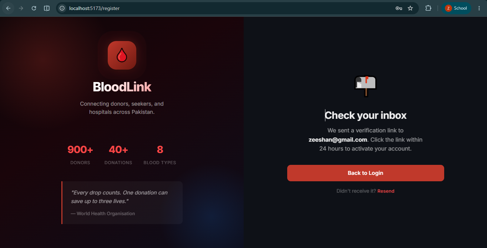

# BloodLink 2.0

A full-stack MERN platform connecting blood donors, seekers, hospitals, and administrators — built with document-based request verification and real-time notifications.

## Screenshots

<div align="center">
  
  
</div>
<br/>
<div align="center">
  
  
</div>
<br/>
<div align="center">
  
</div>

## Stack

| Layer    | Technology                                      |
|----------|-------------------------------------------------|
| Frontend | React 18 · Vite · React Router v6              |
| Backend  | Node.js · Express.js · Mongoose                |
| Database | MongoDB Atlas                                   |
| Auth     | JWT (access + refresh tokens) · bcryptjs        |
| Email    | Nodemailer (Gmail SMTP)                         |
| Storage  | Cloudinary (document uploads — free tier)       |
| Deploy   | Frontend → Vercel · Backend → Render            |

## Project Structure

```
Bloodlink/
├── client/          # React + Vite frontend
│   └── src/
│       ├── context/     # AuthContext
│       ├── hooks/       # useDonorProfile, useSeekerData
│       ├── lib/         # Axios client with refresh interceptor
│       ├── pages/       # auth/, dashboard/
│       └── styles/      # dashboard.css, seeker.css, auth.css
└── server/          # Express.js REST API
    └── src/
        ├── config/      # env.js, db.js
        ├── middleware/  # auth.js, errorHandler.js, upload.js
        ├── models/      # User, Organization, DonorProfile, Request
        ├── routes/      # auth/, donors/, seekers/
        ├── tests/       # eligibility.test.js, compatibility.test.js
        └── utils/       # token, email, eligibility, donorLevels,
                         # compatibility, cloudinaryUpload
```

## Getting Started

### Prerequisites

- Node.js ≥ 18
- A MongoDB Atlas cluster (free tier works)
- A Gmail account with an App Password enabled
- A Cloudinary account (free tier — 25 GB storage)

### Server Setup

```bash
cd server
npm install
cp .env.example .env
# Fill in MONGO_URI, JWT secrets, SMTP, and CLOUDINARY_* values
npm run dev
```

### Client Setup

```bash
cd client
npm install
cp .env.example .env
# Set VITE_API_URL=http://localhost:5000
npm run dev
```

### Running Tests

```bash
cd server
npm test
# 25 tests — eligibility engine + compatibility matrix
```

## Phases

| Phase | Status | Description                                              |
|-------|--------|----------------------------------------------------------|
| 1     | ✅      | Foundation · Auth · Design system                        |
| 2     | ✅      | Donor module · Eligibility engine · Recognition levels   |
| 3     | ✅      | Seeker module · Compatibility matrix · Document upload   |
| 4     | ✅      | Hospital & Partner network · Inventory · Code Red        |
| 5     | ✅      | Admin module · Verification queues · Analytics           |
| 6     | ✅      | Web Push notifications · Demand forecast · In-app bell   |
| 7     | ✅      | QR donation check-in · Donor history · Verify page       |
| 8     | ✅      | Integration · Testing · Deployment configs               |

## Deployment

The project includes configuration files for seamless deployment to modern PaaS providers:

- **Frontend (`client/vercel.json`)**: Configured for Vercel deployment with correct SPA routing and caching headers.
- **Full-stack (`render.yaml`)**: Infrastructure-as-code for Render.com. Defines both the Node.js API and the React static site with all required environment variables.

## Team

Zeeshan Sajid & Irtaza

