# 🩸 BloodSync 2.0

    

> **Save Lives, One Drop at a Time.**
> A high-performance, real-time community blood network featuring multi-layer SWR caching, live emergency feeds, automated hospital inventory syncing, and donor safety guardrails.

---

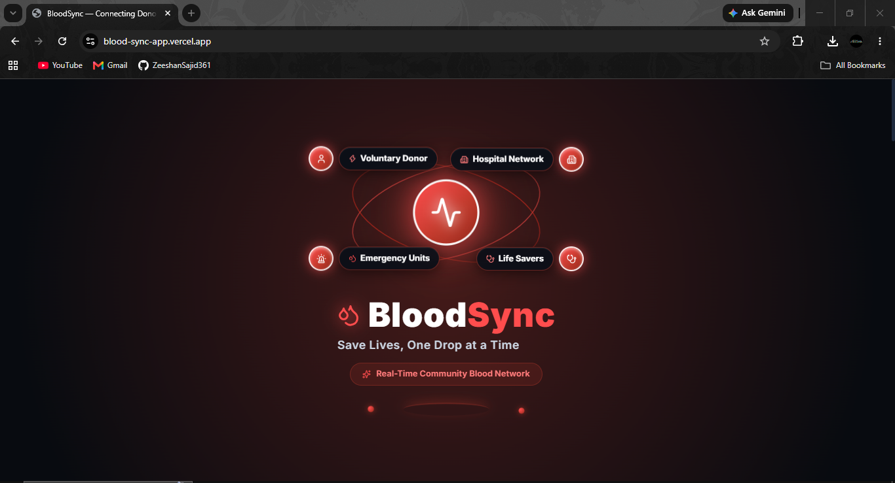

## 🎥 Project Demo Video
[Insert Vertex.ai Demo Video Link Here]

---

## 💡 The Problem & Our Solution

During emergency trauma cases and sudden blood shortages, traditional blood donation networks suffer from fragmented communication, stale inventory data, and manual delays.

**BloodSync 2.0** solves this by implementing an ultra-resilient **Stale-While-Revalidate (SWR) cache architecture** alongside an **Upstash Redis fallback** and **isolated batch shelf-life management**:
* **< 15-Second Emergency Propagation**: Code Red emergencies broadcast instantly to nearby compatible donors.
* **0ms Instant Hydration**: Preserves local user cache while performing silent background validation, eliminating post-login white screen delays.
* **Expiry Contamination Prevention**: Automatically quarantines depleted or expired blood bags (>35 days) into an isolated archive to ensure 100% viable stock metrics.
* **Strict PII Protection**: Masked donor contact details on public search endpoints until a verified emergency request is issued.

---

## 🏗 System Architecture & Flow

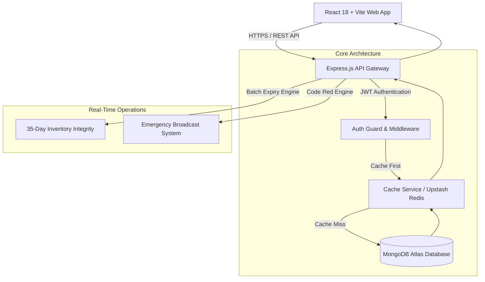

---

## 🖥 Platform Profiles & Core Features

### 🏥 1. Hospital Management & Ready Stock Sync
Hospitals can seamlessly manage freezer stock batches, enforce strict 35-day expiry lifecycles, and auto-trigger low stock alerts. Includes a QR Counter Check-In system for immediate donor unit verification.

| Hospital Overview | Expiry Batch Management |
|---|---|
| 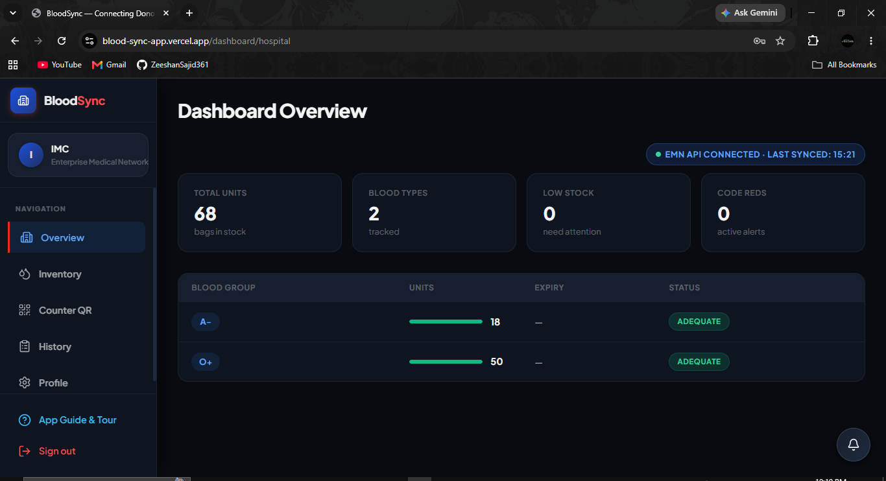 | 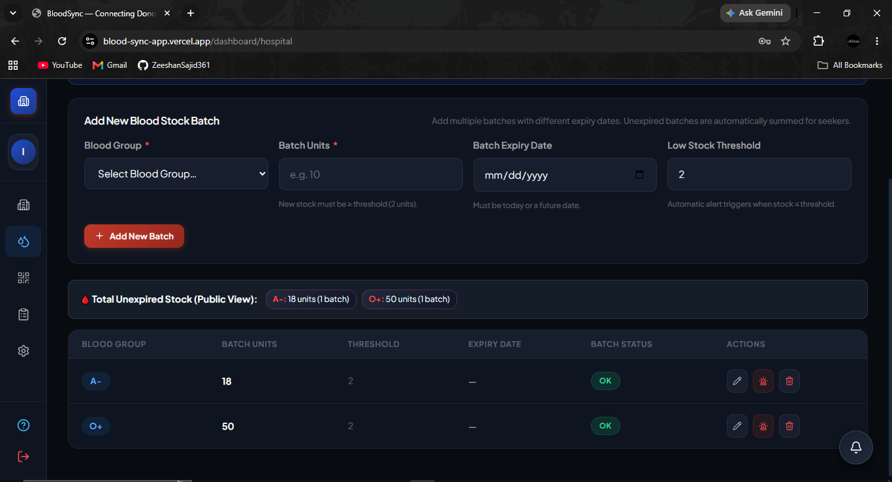 |

---

### 🩸 2. Volunteer Donor Hub & Cooldown Guard
Donors receive real-time emergency blood requests matching their blood group. Built-in WHO safety guardrails enforce mandatory **90-day (male) / 120-day (female)** post-donation cooldown periods before allowing new donation pledges.

| Donor Overview & Cooldown Shield | Live Matching Requests |
|---|---|
| 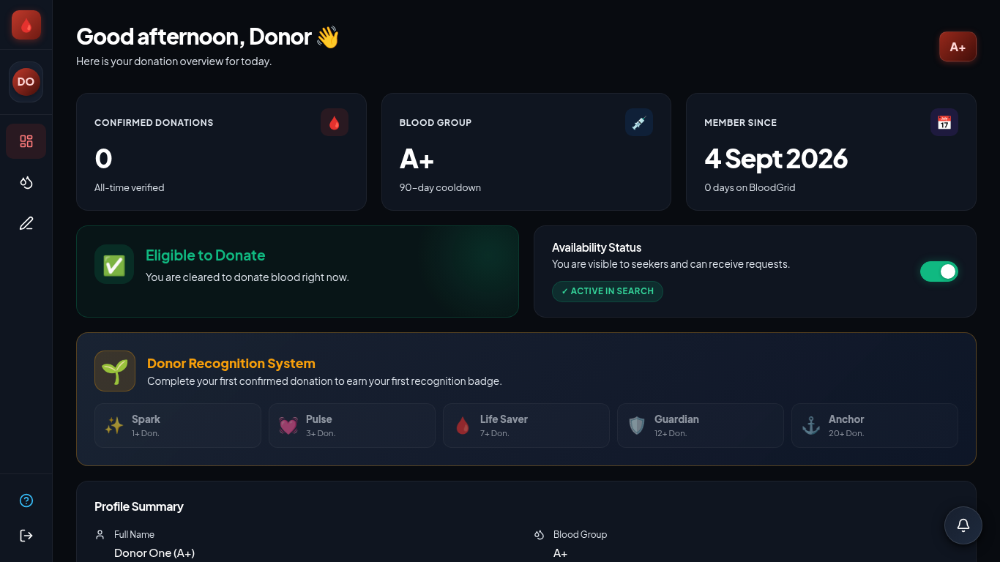 | 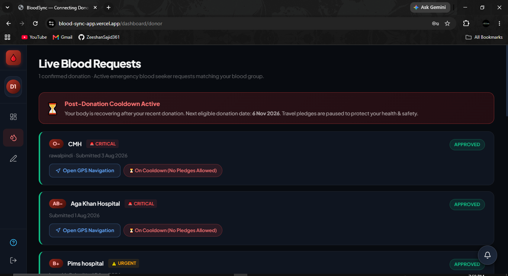 |

---

### 🔍 3. Blood Seeker Portal & Smart Search
Seekers can perform smart donor compatibility queries, view real-time hospital freezer stock, pin exact emergency locations using Google Maps integration, and track blood request progress live.

| Seeker Dashboard & Timeline | Smart Compatibility & Ready Stock |
|---|---|
| 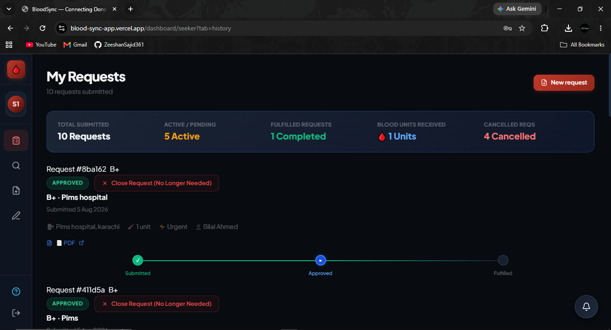 | 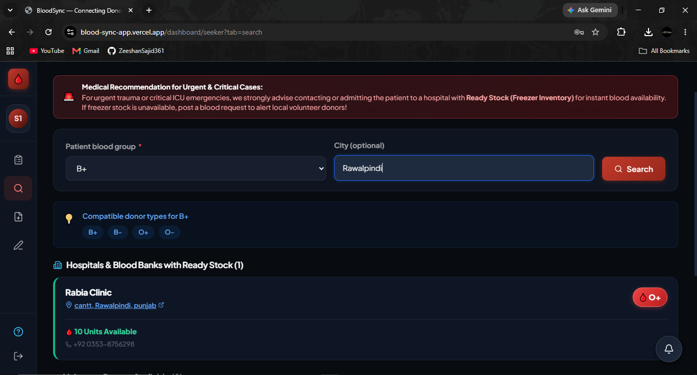 |

---

### 🛡️ 4. System Admin Control Center
Full platform oversight, including hospital document approval, medical slip verification, EMN API key provisioning, and active user moderation.

| Platform Overview | Hospital Verification & EMN Keys |
|---|---|
| 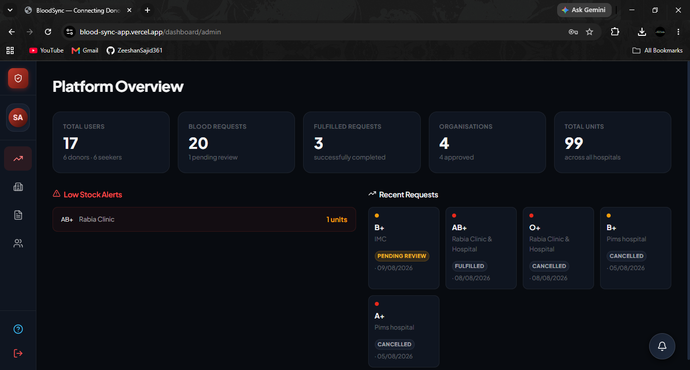 | 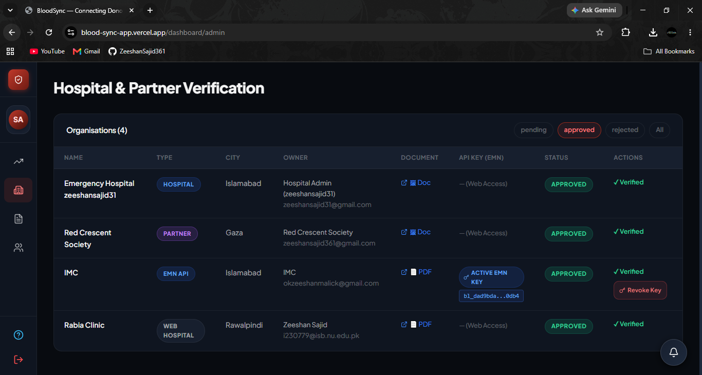 |

---

### 🤝 5. Partner & NGO Network
Partner organizations can organize community blood donation camps and submit assisted requests for vulnerable or non-smartphone users.

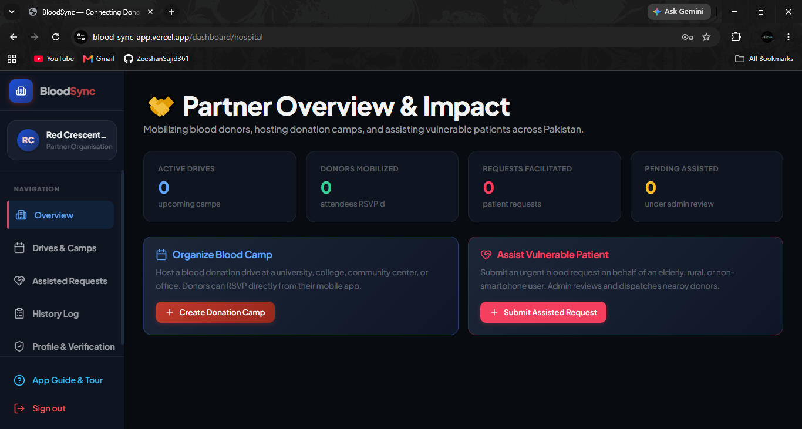

---

## 🚀 Key Features & Tech Stack

* **Frontend**: React 18, Vite, Lucide Icons, Tailwind-inspired Vanilla CSS Design System.
* **Backend**: Node.js, Express.js statelessly configured for Vercel Serverless deployments.
* **Database**: MongoDB Atlas with Mongoose ODM & Transactional Sessions.
* **Caching & Resilience**: SWR Memory Tier with Upstash Redis serverless fallback.
* **Security & Auth**: Dual-token JWT (Access & Refresh Tokens), Bcrypt encryption, full PII masking.
* **Maps Integration**: Interactive Google Maps location picker modal for exact hospital coordinates.

---

## ⚙️ Local Setup Guide

### 1. Clone the Repository
```bash
git clone https://github.com/ZeeshanSajid361/bloodsync.git
cd bloodsync
```

### 2. Environment Configuration
Create a `.env` file in the `server` directory:
```env
PORT=5000
NODE_ENV=development
MONGO_URI=mongodb+srv://<username>:<password>@cluster.mongodb.net/bloodsync
JWT_SECRET=your_jwt_secret_key
JWT_REFRESH_SECRET=your_jwt_refresh_secret_key
UPSTASH_REDIS_REST_URL=your_upstash_redis_url
UPSTASH_REDIS_REST_TOKEN=your_upstash_redis_token
```

Create a `.env` file in the `client` directory:
```env
VITE_API_BASE_URL=http://localhost:5000/api
```

### 3. Install & Start Development Servers
```bash
# Install Server Dependencies
cd server
npm install

# Install Client Dependencies
cd ../client
npm install

# Run Backend
cd ../server
npm run dev

# Run Frontend (in a separate terminal)
cd ../client
npm run dev
```

---

## 👨‍💻 Author & Academic Context

Developed independently by **Zeeshan Sajid** (BS 23 student at FAST NUCES Islamabad).

* **GitHub**: [@ZeeshanSajid361](https://github.com/ZeeshanSajid361)
* **Project Repository**: [ZeeshanSajid361/bloodsync](https://github.com/ZeeshanSajid361/bloodsync)
